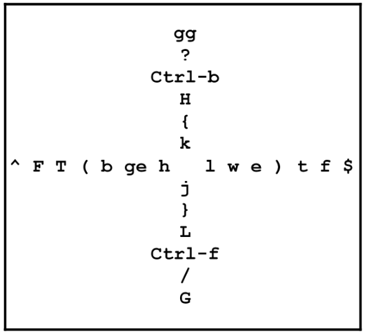

# Vim tricks :D


Assume you know the basics of vim movement:

* h,j,k,l

## Open files inside vim

```
:e file.xyz
```

## Movement

| Key | Action                                      |   |
| --- | ------------------------------------------- | - |
| w   | Move forward by word                        |   |
| e   | Move forward until the end of the word      |   |
| W   | Move forward by WORD                        |   |
| E   | Move forward until the end of the WORD      |   |
| b   | Move backwards to the beginning of the word |   |
| B   | Move backwards to the beginning of the WORD |   |
| {   | Move back by one paragraph                  |   |
| }   | Move forward by one paragraph               |   |

Simple edits examples:

* cw
* c3e
* cb
* c4l
* cW
* dw
* d3e
* db
* d4l
* dW
* cc
* dd

## Read Vim manual

```
:help
```

## Ugly way of installing plugins

* Create a directory if doesn't exist:

```
~/.vim/pack/plugins/start
```

* Make vim load all the documentation for each plugin, to do so add the following lines to `.vimrc` file:

```
packloadall           " Load all plugins.
silent! helptags ALL  " Load help files for all plugins.
```

* Git clone the desired plugin into the created directory, i.e.:

```
 $ git clone https://github.com/scrooloose/nerdtree.git
~/.vim/pack/plugins/start/nerdtree
```

## Basic file navigation

### Open files

This will open another buffer (keeping opened the previous in the background).&#x20;

```
:e <file name>
```

### Buffers

* List buffers:

```
:ls
:buffers
:files
```

* Swtich between open buffers:

```
:b <buffer number>
```

#### Vim `unimpaired` plugin mappings:

* `]b` and `[b` cycle through buffers
* ]f and \[f cycle through files in the same directory as the current buffer
* `]l` and `[l` cycle through the location list (see the Location List section in Chapter 5, Build, Test, and Execute)
* `]q` and `[q` cycle through the quickfix list (see the Quickfix list section in Chapter 5, Build, Test, and Execute)
* `]t` and `[t` cycle through tags (see the Meet Exuberant Ctags section in Chapter 4, Understanding the Text)

### Windows

#### Splitting windows:

```
:sp (shorter version of split)
:vs (shorter version of vsplit)
```

#### Splitted windows movement

To move between splitted windows:

```
Ctrl + w, <h,j,k,l>
```

The above command(s) can be shortened by adding the following mappings to the `.vimrc`(thus movement can be done by just pressing `Ctrl + <h,j,k,l` ) :

```
" Fast split navigation with <Ctrl> + hjkl.
noremap <c-h> <c-w><c-h>
noremap <c-j> <c-w><c-j>
noremap <c-k> <c-w><c-k>
noremap <c-l> <c-w><c-l>
```

#### Moving splitted windows

```
Ctrl + w, <H,J,K,L>
```

Tip!:

`Ctrl + w, r` moves every window within the row or the column (whichever is available—rows are given preference over columns) to the right or downward. `Ctrl + w, R` performs the same operation in reverse.

`Ctrl + w, x` exchanges the contents of a window with the next one (or a previous one if it's considered a last window).

#### Resizing windows

```
" N is the number of cols/rows to resize
:res +N (short version of resize +N)
:res -N (short version of resize -N)
:vert +N (short version of vertical resize +N)
:vert -N (short version of vertical resize -N)
```

The above commands have keyboard shortcuts:

```
Ctrl + w, + (height)
Ctrl + w, - (height)
Ctrl + w, > (width)
Ctrl + w, < (width)
```

* Equalize the height and width of all open windows

```
Ctrl + w, =
```

### Tabs

* Open a new tab with an empty buffer

```
:tabnew
```

* Open a file in a new tab

```
:tabnew <file_name>
```

* To navigate between tabs

```
gt (just type "gt" without entering ":", abbreviation of :tabnext)
gT (just type "gt" without entering ":", abbreviation of :tabprevious)
```

* Close tabs

```
:tabclose (or closing the tab's buffers with :q)
```

* Move X tabs next to the current one

```
:tabmove N
```

### Folds

* To work with folding in Python, you need change a setting called `foldmethod` in your `.vimrc` file.

```
set foldmethod=indent
```

* To open a folded code portion

```
zo
```

* To fold a potential portion of code

```
zc
```

* To visualize where folds are you can use

```
:set foldcolumn=N
```

Where N is 0..12. This will indicate the first N columns to the left of the screen to indicate folds with the - (beginning of an open fold), | (contents of an open fold), and + (closed fold) symbols.

* To toggle folds (open closed folds and close open folds)

```
za
```

* To open and close all folds in the file at the same time using

```
zR
zM
```

* To avoid automatic folding when opening files add the following to your `.vimrc`

```
autocmd BufRead * normal zR
```

#### Types of folds

* manual
* indent
* expr (based on regex, good for complex rules)
* marker (like `{ }`)
* syntax
* diff

### Navigating File Trees

There are different ways to navigate files/directories using vim, here are 5 of them.

#### Netrw

Is a built-in file manager (pre-installed plugin) that comes with vim. It comes fully integrated with vim also.

* Open file navigation window

```
:Ex (abbreviation for :Explore)
```

* Main controls

```
Enter (opens files and directories)
- (goes up a directory)
D (deletes a file or directory)
R (renames a file or directory)
:Vex (opens Netrw in a vertical split)
:Sex (opens Netrw in a horizontal split)
:Lex opens Netrw in a leftmost full-height vertical split)
```

* Remote editing, here is how through SFTP and SCP

```
:Ex sftp://<doman>/<directory>/
:e scp://<domain>/<directory>/<file>
```

#### :e with wildmenu enabled

* Enable wildmenu in your .vimrc file, this will display a navigation line when you type `:e + tab`

```
set wildmenu
```

You can navigate the pane with:&#x20;

```
Tab, Shift+Tab or Left, Right arrows (left/right navigation)
Up, Down arrows (move up/down a directory)
Enter (will open the selected file or directory)
```

* To autocomplete the path to the longest match possible

```
set wildmode=list:longest,full
```

#### Plugin spotlight - NERDTree

Handy plugin that emulates modern IDE behavior by displaying a file tree in a split buffer to the side of the screen.

* To invoke NERDTree

```
:NERDTree
```

* Navigate the file structure

```
h,j,k,l or arrows (move through files/directories)
Enter or o (to open the file)
Shift + ? (brings up a handy cheat sheet)
```

* To bookmark directories

```
:Bookmark (to bookmark a directory when the cursor is over it in a NERDTree window)
B (to display bookmarks at the top of the NERDTree window)
```

* Set bookmarks to always be displayed in NERDTree window, set the following in your .vimrc file

```
let NERDTreeShowBookmarks = 1
```

* To bring up or hide NERDTree

```
:NERDTreeToggle
```

* To set NERDTree up (be displayed) every time you're editing -to auto start when vim starts-, add the following to your .vimrc

```
autocmd VimEnter * NERDTree
```

#### Plugin spotlight - Vinegar

Is a simple plugin that solves the problem of working with multiple split windows and open other files. If you have NERDTree installed when using Vinegar, you'll get a NERDTree window instead of Netrw. To avoid NERDTree replacing NETrw (and to make commands like - work), set the following in your .vimrc file

```
let NERDTreeHijackNetrw = 0
```

#### Plugin spotlight - CtrlP

Is a fuzzy completion plugin that helps you open the files you need quickly, given that you somewhat know what you're looking for.&#x20;

* To use it just

```
Ctrl + p
Enter (opens the file)
```

* If you type something it will match the string with the files in the current directory
* To navigate up/down the list of files

```
Ctrl + j
Ctrl + k
```

* To navigate through buffers and most recently used files

```
Ctrl + f
Ctrl + b
```

* To invoke recently used buffers

```
:CtrlPBuffer
:CtrlPMRU
```

* To search through files, buffers and the most recently used files at the same time

```
:CtrlPMixed
```

* You can also add custom mappings to your .vimrc

### Navigating Text

* `t` (until) followed by a character lets you search for that character in the line and will place the cursor right before it. `T` does the same but backwards.
* `f` (find) followed by a character lets you search for that character in the line and will place the cursor on it. `F` does the same but backwards.
* `_` takes you to the beginning of the line and `$` takes you to the end of it. Also `^` takes you to the beginning of the line.
* Tip!: A word consists of numbers, letters and underscores. A WORD consists of any characters except for whitespace (like spaces, tabs, or newlines).

Here are some new free-form movement options:

* `Shift` + `(` and `Shift` + `)` takes you to the beginning and the end of a sentence
* `H` takes you to the top of the current window, and L takes you the bottom of the current window
* `Ctrl` + `f` (or the Page Down key) scrolls the buffer one page down, and `Ctrl` + `b` (or the Page Up key) scrolls one page up
* `/` followed by a string searches the document for a string and `Shift` + `?` to search backward
* `gg` takes you to the top of the file
* `G` takes you to the bottom of the file

Here is a handy visualization taken from the book (Mastering Vim - Ruslan Osipov), originally posted by Ted Nailed on his blog in 2010.

<figure><figcaption></figcaption></figure>

To move by line numbers. First you should enable line display, run `:set nu` or add `:set number` to your .vimrc file. This will show line numbers at some columns on the left. So you can jump to a specific line by typing `:N` where `N` is the absolute line number. For instance, to jump to line 20, you'll run `:20` followed by `Enter`.

Tip!: You can also tell Vim to open a file and immediately place a cursor at a particular line. For that, add `+N` after the filename when invoking Vim, where `N` is the line number. For example, to open `animal_farm.py` on line 14, you'd run `$ vim animal_farm.py +14`.

Vim also supports relative movement. To move down N lines you'll run `:+N` and to move down you'll run `:-N`. You can also ask Vim to display line numbers relative to the current cursor position with `:set relativenumber`. _-Also you can move relatively up/down between lines just typing `N + j/k` -._


### Jumping into insert mode

There are a few more convenient shortcuts for entering insert mode:

* `a` places you in insert mode after the cursor
* `A` places you in insert mode at the end of the line (equivalent of `$a`)
* `I` places you in insert mode at the beginning of the line, but after indentation (equivalent of `_i`)
* `o` adds a new line below the cursor before entering insert mode
* `O` adds a new line above the cursor before entering insert mode
* `gi` places you in insert mode where you last exited it

Here are some ways to chain change command (`c`):

* `C` deletes text to the right of the cursor (until the end of the line) before entering insert mode
* `cc` or `S` deletes the contents of the line before entering insert mode, while preserving indentation
* `s` deletes a single character (prefix by a number to delete multiple) before placing you in insert mode

### Searching with / and ?&#x20;

* Type `/` this will put you on command line mode, then type the string you're looking for and hit `Enter`. You can cycle through the matches by pressing `n` to go forward and `N` to go backwards.
* A useful setting is `set hlsearch`, this will highlight every match on the screen, so consider to add it to your `.vimrc` file.
* Another setting could be `set incsearch`which will make Vim dynamically move you to the first match as soon as you type.

### Searching across files

Vim has two commands to help you search across files, `:grep` and `:vimgrep` :

* `:grep` uses system `grep`, and  is a great tool if you're already familiar with how `grep` works.
* `:vimgrep` is part of Vim, and might be easier to use if you are not already familiar with `grep`.

The syntax of `:vimgrep` is: `:vimgrep <pattern> <path>`. The pattern could be a string of a Vim-flavored regular expression. The path will often be a wildcard, use `**` as a path to search recursively (or `**/*.py` to restrict by filetype).

To navigate through the matches, use: `:cn` or `:cp`. However you might want to open a visual quickfix window by using `:copen`. You can navigate the quickfix list with `j` and `k` and jump to a match by pressing `Enter` . The quickfix window can be closed like any other window by typing `:q` or running `Ctrl + w` .

### ack

On Linux, you can use Vim in conjunction with `ack` to search through code bases. `ack` is the spiritual successor of `grep`, and is focused on working with code. Vim has a plugin that integrates the result of ack in Vim's quickfix window. The plugin is available from `https:/​/​github.​com/​mileszs/​ack.​vim`. After installation, you will be able to execute `:Ack` from Vim.

### Utilizing Text Objects

Text objects are an additional type of object in Vim. Text objects allow you to manipulate text withing parentheses or quotes. Text objects are only available when combined with other operators like change or delete or a visual mode.

Text objects come in two flavors, inner objects (prefixed by `i`) and outer objects (prefixed by `a`) Inner objects do not include white space (or other surrounding characters), while outer objects do.

A full list of text objects can be looked up through `:help text-objects`, but some interesting ones are as follows:

* `w` and `W` for word and WORDs
* `s` for sentences
* `p` for paragraphs
* `t` for HTML/XML tags

Pairs of characters that are most often used in programming are all supported as text objects: `` `, ', ", ), ], >, } `` , select the text enclosed by the characters.

One way to think about working with text objects is that it's like constructing sentences. Here are the two examples:


| Verb       | (Number) | Adjective   | Noun           |
| ---------- | -------- | ----------- | -------------- |
| `d` delete |          | `i` inside  | `)`parentheses |
| `c` change | 2        | `a` outside | `w`word        |

### Plugin spotlight - EasyMotion

It simplifies navigation by allowing you to jump to the desired position with speed and precision. It's available from `https:/​/​github.​com/​easymotion/​vim-​easymotion` . After installing it, you can invoke the plugin by hitting the leader key (`\`) twice, followed by the desired movement key.

EasyMotion supports the following movement commands by default (all prefixed by double tapping the leader key):

* `f` to look for a character to the right and `F` to look for the character of the left
* `t` to move until the character on the right and `T` until the character on the left
* `w` to move by word (and `W` by WORD)
* `b` to move backward by word (and `B` by WORD)
* `e` to move forward to the end of the word (and `E` for the WORD)
* `ge` to move backward to the end of the word (and `gE` for the WORD)
* `k` and `j` to go to the beginning of the line up or down
* `n` and `N` for jumping through search results on the page (based on the last `/` or `?` search)

You should check `:help easymotion` to see everything EasyMotion can do.

### Copying and pasting with registers

You can copy text by using the `y` (yank) command, followed by a movement or a text object. You can also hit `y` from a visual mode when you have selected some text. In addition to all of the standard movement, you can use `yy` to yank the contents of the current line.

To paste the code hit `p`. You can even prefix the paste command with a number in case you want to duplicate something multiple times.

### Where do registers come in?

Whenever you copy and paste text, it's saved in a register. Vim allows you to operate with many registers, which are identified by letters, numbers, and special symbols. Registers can be accessed by hitting `"`, followed by the register identifier, followed for the operation on said register.

Registers `a` - `z` are used for holding manually assigned data. For example, to yank a word into the a register, you can run `"ayw` and paste it using `"ap`.

All of the operations you've performed so far have used the unnamed register. If you ever need to access the unnamed register explicitly, it is identified by a double quote character, `"`. For example, you can use `""p` to paste from the unnamed register (which is the same as just invoking `p`).

Numbered registers are effectively a history of your last 10 delete operations. 0 accesses the last deleted text, 1 the one before it, and so on. For example, if you have stellar memory, you can paste some text you yanked seven yank operations ago by hitting `"7p`.

There are some read-only registers you might find handy: `%` holds the name of the current file, `#` holds the name of the previously opened file, `.` is the last inserted text, and `:` is the last executed command.

You can also interact with buffers from outside of a normal mode. `Ctrl + r` is a convenient shortcut, which allows you to paste a register's contents when you're in insert or command- line modes. For example, while you're in insert mode, `Ctrl + r, "` will paste the contents of the unnamed buffer at the position of the cursor.

You can access the content of a register at any time by running `:reg <register names>` .

In addition, you can list the contents of every register by running `:reg` without any parameters.

Named registers (`a`-`z`) can be appended to as well. To append to a register instead of overwriting it, capitalize the register name. For example, to append a, word to register a, run `"Ayw` with a cursor at the beginning of the word.

### Copying from outside of Vim

There are two built-in registers that interact with the outside world:

* The `*` register is the primary system clipboard (the default clipboard in Mac and Windows, and mouse selection inside a Terminal in Linux)
* The `+` register (only in Linux) is used for Windows-style `Ctrl + c` and `Ctrl + v` operations (referred to as Clipboard selection)

If you want Vim to work with these registers by default, you can set the `clipboard` variable in your `.vimrc` file. Set it to unnamed to copy and paste from the `*` register:

* `set clipboard=unnamed " Copy into system (*) register.`
* Set it to `unnamedplus` for yank and paste commands to work with the + register by default: `set clipboard=unnamedplus " Copy into system (+) register.`
* You can also tell Vim to use both at once: `set clipboard=unnamed,unnamedplus " Copy into system (*, +) register.`

You can also sometimes choose to paste text from the system clipboard while inside the insert mode. In older Vim versions or in certain Terminal emulators, this will yield some issues, since Vim will try to automatically indent code or extend commented out sections. To avoid this, run `:set paste` before pasting code to disable auto indent and auto comment insertion. Run `:set nopaste` to turn it back on once you're done.

Most of these issues are resolved in bracketed paste mode, which is enabled by default, starting with version 8.0. See `:help xterm- bracketed-paste` for more details.

## Deeper dive into modes

Vim has 7 primary modes.

### Normal mode

Is the default mode when you open Vim, you can go back to it from other modes by pressing `Esc` key (sometimes twice).

### Command-line and ex modes

Is entered by typing a colon (`:`) or when searching for text with `/` or `?`, and allows you to input a command until you hit Enter. It has some useful shortcuts:

* The up and down arrows (or `Ctrl + p` and `Ctrl + n`) let you traverse command history one by one
* `Ctrl + b` and `Ctrl + e` let you go to the beginning and the end of the line respectively
* The `Shift` or `Ctrl` keys combined with left or right arrows allows you to move by words

A highly useful shortcut is Ctrl + f, which opens an editable command-line window with a history of the commands you ran. For editing purposes, it's a regular buffer, so you can find a command you've executed before, edit it (the way you'd edit any text in Vim), and execute it again. You can press `Enter` to execute the line your cursor is on or `Ctrl + c` to close the buffer.

You can learn more about working with command-line mode by looking up `:help cmdline-editing`.

Vim has a variation of the command-line mode called ex mode, which is entered by pressing `Q`. Ex mode is a compatibility mode with Vim's precursor—`ex`. It allows you to execute multiple commands without exiting the mode after each command, but has very limited uses today.

### Insert mode

Es used to type in text, and that's about it. Hitting `Esc` takes you back to normal mode, which is where you should be performing most of your work. When in insert mode, you can also use `Ctrl + o` to execute a single normal mode command and end up back in insert mode.

Insert mode is indicated by -- INSERT -- displayed in a status line.

### Visual mode

Allows for an arbitrary selection of text (usually to perform some sort of operations on). It's useful when you want to work with a section of a file that does not map to an existing text objects (word, sentence, paragraph, and so on). There are three ways to enter visual mode:

* `v` enters a character-wise visual mode (status line text: -- VISUAL --)
* `V` enters a line-wise visual mode (status line text: -- VISUAL LINE --)
* `Ctrl + v` enters a block-wise visual mode (status line text: -- VISUAL BLOCK --)

You can control the selection by doing the following:

* Pressing `o` to go to the other end of the highlighted text (hence allowing the selection to expand from the other side)
* Pressing `o` when in block-wise visual mode to the other end of the current line

You can always hit `Esc` to come back to normal mode without making a change.

Vim also has a select mode, which emulates selection mode in other editors: pressing any printable character immediately erases the selected text and enters the insert mode (so the usual movement commands don't work here). You can enter select mode by pressing `gh` from normal mode or `Ctrl + g` from visual mode and exit it by pressing `Esc`.

### Replace and virtual replace mode

Replace mode behaves similarly to those times you accidentally press the Insert key on your keyboard and wonder why typing erases text. When working with replace mode, the text you type is placed over existing text (as opposed to moving the existing text in insert mode).

You can enter replace mode by hitting `R`. You'll see --REPLACE-- in the status line. Now, you'll be replacing text as you type.

Hit `Esc` to exit replace mode and go back to normal mode.

You can press `r` to enter replace mode for a single character press before being switched back to normal mode.

Vim also provides virtual replace mode, which behaves similarly to replace mode, but operates in terms of screen real estate as opposed to characters in a file. The main noticeable differences include `Tab` replacing multiple characters (as opposed to a single character in replace mode) or `Enter` not creating an addition line, but moving onto the next line. You can enter virtual replace mode using `gR`, and you can read more about it by reading `:help vreplace-mode`.

### Terminal mode

Terminal mode came to Vim in version 8.1, and it allows you to run a Terminal in a split window. You can enter terminal mode by typing `:terminal` or `:term` (shortened command). This will open your system's shell in a horizontal split.

You can also use `:term` to execute a single command and place its output in a buffer. The output is immediately available to us in a horizontal split.

### Remapping commands

There are 4 ways to map/remap commands:

* `:map` is used for recursive mapping
* `:noremap` is used non-recursive mapping
* `:unmap` is used for explicitly remove a mapping
* `:mapclear` there is a nuclear map for this, which drops both, user-defined and default mappings

Vim ofter uses exclamation mark (`!`) to command execution.

Here are some special keys that could be useful for mapping/remapping:

* Ctrl + some\_key: `<c-_>`
* `<a-_>` _or `<m-_>`_ represents Alt pressed with some key
* `<s -_>` represents a Shift press
* `<space>`: spacebar
* `<esc>`: Esc
* `<cr>`,`<enter>`: Enter
* `<tab>`: Tab
* `bs`: Backspace
* `<up>`,`<down>`,`<left>`,`<right>`: Arrow keys
* `<pageup>`,`<pagedown>`: Page Up and Page Down
* `<f1>` to `<f12>`: Function keys
* `<home>`,`<insert>`,`<del>`,`<end>`: Home, Insert, Delete, and End

A command is terminated by `<cr>` which stands for carriage return (Enter key).

You can use `<nop>` which stands for  _no operation_, if you want the key to not do anything.

### Mode-aware remapping

The `:map` and `:noremap` commands work for normal, visual, select, and operator pending modes. Vim supports a more fine-grained control over which modes the mappings work in:&#x20;

* `:nmap` and `:nnoremap`: Normal mode&#x20;
* `:vmap` and `:vnoremap`: Visual and select modes&#x20;
* `:xmap` and `:xnoremap`: Visual mode&#x20;
* `:smap` and `:snoremap`: Select mode&#x20;
* `:omap` and `:onoremap`: Operator-pending mode
* `:map!` and `:noremap!`: Insert and command-line modes&#x20;
* `:imap` and `:inoremap`: Insert mode&#x20;
* `:cmap` and `:cnoremap`: Command-line mode

### The leader key

The leader key is essentially a namespace for user or plugin defined shortcuts. Within a second of pressing the leader key, any key that's pressed will be in from that namespace. The default leader key is a backslash `\`.

To rebind the leader key, set the following in your `.vimrc` file:

```
" Map the leader key to a comma.
" let mapleader = ','

" Map the leader key to a spacebar.
" let mapleader = "\<space>"
```

You'll want to define your leader key closer to the top of `.vimrc`, as the newly defined leader key will only apply to mappings defined after its definition.

When you rebind a key, it's default functionality is overwritten.

The escape character `\` is needed before space since `mapleader` doesn't expect special characters (like `space`). Double quotes (`"`) are also necessary for the escape to work, since single quotes (`'`) only allow literal strings.

More often than not, you will use a leader key to map plugin functionality in a way that's easy for you to memorize, as in the following example:

```
" noremap <leader>n :NERDTreeToggle<cr>
```

## Understanding the Text

Code bases tend to grow to be large and navigating them often becomes problematic. Luckily, Vim has a few aces up its sleeve when it comes to navigating complex code.

### Code Autocomplete

Vim has some built-in autocomplete functionality, and there are plugins that expand upon this.

#### Build-in autocomplete

Vim supports native autocomplete based on words available in open buffers. It's available out of the box starting with Vim 7.0. Start by typing the beginning of a function name and hit `Ctrl + n` to bring up the autocomplete list. You can navigate the list using `Ctrl + n` and `Ctrl + p` (or with up/down arrow keys).

Vim has an insert-completion mode, which supports multiple completion types. Press Ctrl + x followed by one of the following keys:

* `Ctrl + i` to complete the whole line
* `Ctrl + j]` to complete tags
* `Ctrl + f` to complete filenames
* `s` to complete spelling suggestions (if `:setspell` is enabled)

Read `:help ins-completion` for a full list of supported commands—everyone's workflow is unique, and you never know which commands you'll find yourself utilizing a lot. You should also check `:help 'complete'`, which is an option that controls where Vim looks for completion (by default, Vim looks in buffers, tag files, and headers).

#### YouCompleteMe

YouCompleteMe takes a built-in autocomplete engine and pumps steroids into it. YouCompleteMe has a few distinctive features that elevate it beyond built-in autocomplete:

* Semantic (language-aware) autocomplete; YouCompleteMe understands your code a lot better than built-in autocomplete
* Intelligent suggestion ranking and filtering
* An ability to display documentation, rename variables, autoformat code, and fix certain types of errors

As you do, autocomplete suggestions will pop up. The Tab key will cycle through suggestions. Furthermore, if YouCompleteMe is able to look up function definition, together with a supporting docstring, it will show up in a preview window at the top of the screen.

The preview window only shows up when YouCompleteMe uses the semantic autocomplete engine. The semantic engine is automatically invoked after typing `.` (period) in insert mode or manually by pressing `Ctrl + spacebar`.

For Python, YouCompleteMe also allows you to jump to function definition. Add the following mapping to your .vimrc file:

```
noremap <leader>] :YcmCompleter GoTo<cr>
```

Now, with the cursor over a function call, press your leader key (backslash (`\`) by default), followed by `]`. You will be taken to the function definition.

### Navigating the code base with tags

Vim has a built-in feature that allows you to navigate to the definition of a variable in the same file. With the cursor over a word, press `gd` to go to the declaration of the variable.

`gd` will look for a local variable declaration first. There's also `gD`, which will look for a global declaration (starting at the beginning of at the file instead of the beginning of the current scope).

> _This feature is not syntax aware, as out-of-the-box Vim does not know how your code is structured semantically. However, Vim supports tags—a file of semantically meaningful words and constructs across your files. For example, in Python, likely candidates for tags are classes, functions, and methods._

### Exuberant Ctags

Exuberant Ctags is an external utility that generates tag files.

Ctags introduces a `ctags` binary, which allows you to generate a tags file for your code base.

Navigate to your code project and type the following:

```
ctags -R .
```

This creates a `tags` file in the directory you're in.

You may want to set the following option in your `.vimrc` file:

```
set tags=tags;    " Look for a tags file recursively in
                  " parent directories.
```

This will make sure that Vim looks for the `tags` file recursively in parent directories to allow you to use a single `tags` file for the whole project. Semicolon (`;`) is what tells Vim to keep looking in parent directories until a tags file is found.

To navigate to a variable or a semantic relevant word: Hit `Ctrl` + `]` to follow the tag to the definition. And use `Ctrl` + `t`  to go back in the tag stack. Jump list navigation with `Ctrl` + `o` and `Ctrl` + `i` also works, however, the two are using different lists.

If you have multiple tags with the same name, you can cycle through the available options by using the `:tn` (next tag) and `:tp` (previous tag) commands.

You can also bring up a list of tags by using the `:ts` (tag select) menu.

You can also open a tag and select the menu instead of jumping to the tag under the cursor using `g]`.

#### Automatically updating the tags

You probably don't want to have to manually run the `ctags -R` . command every time you make changes to the code. The simplest way to address this is to add the following to your `.vimrc` file:

```
" Regenerate tags when saving Python files.
autocmd BufWritePost *.py silent! !ctags -R &
```

You can replace the preceding `*.py` extension with different file extensions depending on the language you'd like to work with.

### Undo tree and Gundo


Gundo requires Vim compiled with python2 support. As of today (2024-10-11) in Arch, python2 it is still available in the AUR.


Most modern editors support an undo stack, with undoing and replaying operations. Vim takes that one step further by introducing an undo tree. If you make a change, X, undo it, and then make a change, Y—Vim still saves the change, X. Vim supports manually browsing undo tree leaves, but there's a better way to do this.

Gundo is a plugin that visualizes the undo tree. Executing `:GundoToggle` will open two new windows in a split: the visual representation of the tree (top-left) and the difference between that version and a previous snapshot (bottom-left).

With your cursor over the Gundo window, you can navigate up and down the the tree with `j` and `k`. Hit `Enter`, and Gundo will restore the edit!

Run `:GundoToggle` again to hide the undo tree.


If you want to learn more about the undo tree, see `:help undo-tree`.



You should check `undotree` plugin, it doesn't require Vim python2 support. [https://vimawesome.com/plugin/undotree-vim](https://vimawesome.com/plugin/undotree-vim)


## Build, Test and Execute

### Integrating Git with Vim

`vim-fugitive` is a plugin made by Tim Pope that helps working with Git while being into/inside vim. I will not dig deep into this since I prefer to work with Git separately.

### Resolving conflicts with vimdiff

Often, during the development, you'll find yourself needing to compare some files—be it comparing different output or versions of a file, or dealing with merge conflicts. Vim provides `vimdiff`, a standalone binary that excels at file comparison operations.

#### Comparing two files

Open files with `vimdiff`:

```
$ vimdiff animals/cat.py animals/dog.py
```

You can navigate from one change to another by using `]c` to move forward and `[c` to move backward.

You can pull or push changes from one file to another

* `do` or `:diffget` (do stands for diff obtain) will move the change to the active window
* `dp` or `:diffput` (stands for diff put) will push the change from the active window

If you want to copy the content of a whole file from one file into another, you can use the `:%diffget` or `:%diffput` commands.

vimdiff automatically updates the highlighting if you're using `:diffget` and `:diffput` to move changes between files. If you edit the files manually, you'll have to update the highlighting by running `:diffupdate`, or `:diffu` for short.

You can work with more than 3 files/buffers at the same time with `vimdiff` but `:diffget` and `:diffput` will not work as before, you'll need to specify the buffer number/name you want to send/get the changes.

#### Vimdiff and Git

Using `vimdiff` as a Git merge tool can be pretty confusing—Vim bombards you with four windows, a number of keywords, and not a lot of explanation.

First and foremost, configure Git to use `vimdiff` as a merge tool:

```
$ git config --global merge.tool vimdiff
$ git config --global merge.conflictstyle diff3
$ git config --global mergetool.prompt false
```

When you are going to merge changes from one branch to another you should be using this:

`$ git mergetool`

This will display a vim editor with 4 windows:

* LOCAL: This is file from the current branch (or whatever you're merging into)&#x20;
* BASE: The common ancestor—how the file looked before both changes took place
* REMOTE: The file you are merging from another branch (no-dogs in this case)
* MERGED: The merge result—this is what gets saved as output

In the MERGED window, you'll see conflict markers. You don't need to interact with them directly, but it's good to have a vague idea of what they mean. Conflict markers are identified by `<<<<<<<` and `>>>>>>>`:

```
<<<<<<< [LOCAL commit/branch]
[LOCAL change]
||||||| merged common ancestors
[BASE - closest common ancestor]
=======
[REMOTE change]
>>>>>>> [REMOTE commit/branch]
```

Assuming you want to keep the `REMOTE` change, move your cursor to the window with `MERGED` file. Now move the cursor to the next change. Now execute the following:

```
:diffget REMOTE
```

This will get the change from the `REMOTE` file and place it into the MERGED file. You can shorten these commands:

* Get a `REMOTE` change using `:diffg R`
* Get a `BASE` change using `:diffg B`
* Get a `LOCAL` change using `:diffg L`

Merge conflicts tend to leave `.orig` files in your working directory (for example, `animal_farm.py.orig`); feel free to discard those once you're done merging.

### Terminal mode

Historically, you can run shell commands from Vim by using `:!` followed by a shell command.

Things have got better since then. In version 8.1, Vim introduced the terminal mode. The terminal mode is effectively a Terminal emulator running within your Vim session. Unlike with tmux, terminal mode plays with Vim out of the box. It's great for running long running commands while you continue to work in Vim.

Terminal mode can be invoked by executing the following:

```
:term
```

This opens a horizontal split with your default shell running.

The Terminal window is treated like any other window, and can be resized and moved as usual. The window is running in a terminal-job mode, something akin to an insert mode. But there are a few specific key bindings:

* `Ctrl + w`, `N` enters a terminal-normal mode, which behaves just like a normal mode. Operations that take you back to insert mode (such as `i` or `a`) will take you back to a terminal-job mode.
* `Ctrl + w`,`"` followed by a register will paste the contents of a register into a terminal. For example, to paste something you yanked with `yw`, you can execute `Ctrl-w` + `"` to paste from the default register.
* `Ctrl` + `w`, `Ctrl` + `c` sends `Ctrl` + `c` to the running command in a Terminal.

The best feature of a terminal mode is that you can invoke terminal mode with a specific command, and get full access to the output, i.e.:

```
:term python3 animal_farm.py cat dog sheep
```

If you so desire, you can open a Terminal in a vertical split by running:

```
:vert term
```

If you use the `Ctrl` + `hjkl` shortcuts to navigate your Vim windows, you may want to add an additional set of bindings to your `.vimrc` file to work with the terminal mode:

```
tnoremap <c-j> <c-w><c-j>
tnoremap <c-k> <c-w><c-k>
tnoremap <c-l> <c-w><c-l>
tnoremap <c-h> <c-w><c-h>
```

### Building and testing

#### Quickfix list

Vim has an additional mode that makes jumping to certain parts of files easier. Some Vim commands use it to navigate between positions in files, such as jumping to compile errors for `:make` or search terms for `:grep` or `:vimgrep`.

For example, using `:grep` would be something like:

```
:grep -r --include="*.py" animal .
```

This will open the first match in a current window. To open a quickfix window and see all of the matches, execute the following:

```
:copen
```

You can navigate the quickfix window as usual.

You can close the quickfix list with `:cclose` (or `:bd` to delete the quickfix buffer if it's in an active window).

You can also navigate the quickfix list without opening the quickfix window:

* `:cnext` (or `:cn`) navigates to the next entry in the quickfix list
* `:cprevious` (or `:cp`, `:cN`) navigates to the previous entry in the list

Lastly, you can choose to only open the quickfix window if errors (such as compile errors) are found: `:cwindow` (or `:cw`) will toggle the quickfix window only if errors are present.

#### Location list

In addition to a quickfix list, Vim also has a location list. It behaves just like a quickfix list, except that it stays local to the current window. While you can have only one quickfix list in a single Vim session, you can have as many location lists as you want.

To populate a location list, you can prefix most quickfix-operating commands with the letter `l` (such as `:lgrep` or `:lmake`).

Shortcuts also replace the `:c` prefix with the `:l` prefix:

* `:lopen` opens the location window
* `:lclose` closes the window
* `:lnext` navigates to the next item in a location list
* `:lprevious` navigates to the previous item in a location list
* `:lwindow` toggles the quickfix window only if the errors were present

> In general, you will use a quickfix list when the results need to be accessed in multiple windows, while a location list is great for capturing output relevant to a single window.

#### Building code

Vim provides a `:make` command, which wraps around the Unix make utility. In case you're not familiar, Make is a build management solution as old as time (and if it ain't broke...) that allows you to recompile parts of a bigger program (or all of it) as needed.

Some relevant options you'd want to be aware of are as follows:

* `:compiler` lets you specify a different compiler plugin, which also modifies the expected format output for the compiler
* In particular, `:set errorformat` defines a set of recognized error formats
* `:set makeprg` sets what program to execute when running :lipstick:

Want to learn more about one of these options? Don't forget that you can run `:help <anything>` to look up an entry in the Vim manual.

The two can be used in conjunction to work with any compiler. For example, if you wanted to compile a C file you're working on, you could invoke `gcc` (standard issue C compiler) by running the following:

```
:compiler gcc
:make
```

What makes `:make` important is that it allows Vim users to implement syntax checkers, test runners, or just about anything else that spits out references to lines as a compiler plugin, giving us access to quickfix or location windows!

Terminal mode, introduced in Vim 8.1, is also a solid candidate for long-running builds, as `:term make` will call make asynchronously while you continue working on your code.

#### Plugin spotlight: vim-dispatch

Tim Pope supercharges the :make command, makes it asynchronous, and adds a whole bunch of syntactic sugar and additional commands to support its use. A big chunk of vim- dispatch became obsolete with Vim 8.1 rolling out terminal mode support, however, depending on your preferred workflow, integration with different terminal emulators can be very useful.

#### Testing code

Test output happens to be a lot less uniform than compile errors, so your bet here is using test-runner-specific plugins you can find online. There are as many plugins as there are test runners, if not more.&#x20;

In addition, terminal mode, added in Vim 8.1, provides a good way to run tests while continuing to work on your code.

#### Plugin spotlight: vim-test

This is the most popular test runner, as it provides a set of compilers (as well as handy mappings) for plugging into a lot of test runners. You'll have to make sure you have the desired test runner already installed before using vim-test.

vim-test supports the following commands:

* `:TestNearest` runs the test nearest to the cursor
* `:TestFile` runs the tests in the current file
* `:TestSuite` runs the entire test suite
* `:TestLast` runs the last test

#### Syntax checking and code linters

Syntax checking (also known as linting) has essentially become a staple in any multi-person software project. There are many linter programs available online, which support different languages and styles.

If you're not accustomed to using linters, you might be wondering how to silence warnings you don't care for. Each linter has its own syntax for silencing warnings.

#### Plugin spotlight - Syntastic

Syntastic is the go-to plugin when it comes to syntax checking. It supports over 100 languages (and can be extended with smaller syntax checker plugins).

Syntastic does not provide newbie-friendly defaults, so you may want to have the following in your .vimrc file:

```
set statusline+=%#warningmsg#
set statusline+=%{SyntasticStatuslineFlag()}
set statusline+=%*

let g:syntastic_always_populate_loc_list = 1
let g:syntastic_auto_loc_list = 1
let g:syntastic_check_on_open = 1
let g:syntastic_check_on_wq = 0

let g:syntastic_python_pylint_exe = 'pylint3'
```

So every time you open a file (python in this case) you'll see a quickfix window at the bottom with any relevant information like syntatic errors, etc.

There are a few things going on here, from top to bottom:

* Lines with syntactic errors are highlighted with `>>`
* Offending characters or strings are highlighted as well
* A location list is open, listing everything wrong with the current file
* A status line is displaying the error on a currently open line

Since this is a regular location list, you can use the usual location list shortcuts to navigate (for example, :lnext or :lprevious).

If you were to fix the error, the syntax error list updates as soon as you save the file.

#### Plugin spotlight - ALE

Asynchronous Lint Engine (ALE) is a more recent player on the field, but it's been getting nearly as much traction as Syntastic has. Its primary selling point is that ALE displays lint errors as you type, and it runs the linters asynchronously. ALE requires Vim 8+ or Neovim for asynchronous calls to work.

You can see the line with an error highlighted with `>>`, and the status line displays the relevant `linmessage` at the bottom.

You can toggle ALE on and off by running `:ALEToggle` if you don't like to be nagged by it.

ALE is a lot more than just a linter though, and is a full-blown language server protocol client: it supports autocompletion, traveling to definitions, and so on.

For reference, you can jump to definitions by running `:ALEGoToDefinition` and look for references using `:ALEFindReferences`. In order to enable autocomplete, you'll need the following line in your `.vimrc` file:

```
let g:ale_completion_enabled = 1
```

## Refactoring Code with Regex and Macros

### Search and replace with regular expressions

#### Search and replace

Vim supports search and replace through the `:substitute` command, most often abbreviated to `:s`. By default, `:s` will replace one substring with another in a current line. It has the following format:

```
:s/<find-this>/<replace-with-this>/<flags>
```

The flags are optional.

Now, let's look at the flags you can pass to the substitute command:

* `g`—global replace: replace every occurrence of the pattern, not just the first one
* `c` —confirm each substitution: prompt the user before replacing the text
* `e` —do not show errors if no matches are found
* `i` —ignore case: make the search case-insensitive
* `I` —make the search case-sensitive

You can mix and match these (except for `i` and `I`) as you see fit.

`:substitute` can be prefixed by a range, which tells it what to operate on. The most common range used with :substitute is `%`, which makes `:s` operate on the current file.

The `:substitute` command conveniently tells us how many matches were replaced in the status line at the bottom of the screen.

`:substitute` supports more ranges. Here are some common ones:

* numbers—a line number
* `$`—the last line in the file
* `%`—a whole file (this is one of the most used ones)
* `/search-pattern/`—lets you find a line to operate on
* `?backwards-search-pattern?`—does the same thing as the previous flag, but searches backwards

### Regex


Honestly I don't like too much Regex, I've read about it in the book and -at least for now- they don't convince me. Anyways, read about them in the book, they seem useful in some cases.


### Recording and replaying Macros

Macros are an extremely powerful tool that allow you to record and replay a set of actions.

You can enter macro recording mode using `q` followed by any register, you'll see recording `@<register>` in a status line, which indicates that the macro is recording.

After recording the macro you can replay the macro using `@<register>`. A handy shortcut is `@@`. `@@` replays the last macro you ran.

You can repeat the macro multiple times by prefixing it with a number: `2@<register>`.

However, if, for instance, you are searching as part of your macro, the search may wrap back to the beginning of the file and replay a macro on a portion of file you've already modified. That's where working with macros can get messy. All macros do is record your actions and replay them back. A macro stops executing if it encounters an error. If there are no patterns we're searching for below the cursor, Vim just looks for one above the cursor—without producing an error. So we just need to manually produce an error, to make sure the macro doesn't continue running when it doesn't have to. n this particular case, we can tell search to stop wrapping back around, and, instead, produce an error when reaching the end of the file:

```
:set nowrapscan
```

#### Editing macros

In order to edit macros you can basically see their content (using `:reg`) of the register in which you stored the macro, copy and paste it in another buffer (to see a register content: `:echo @<register>`), then edit/change it and place the modified text into the register (i.e. using: `_"a<register>y$.`).

#### Recursive macros

First of all you need to ensure that the register you'll use is empty, you can easily clean/empty a register by using:

```
q<register>q
```

And after cleaning the register you can start recording the macro, but this time add the following at the end (before stopping the recording with `q` ):

```
@<register>
```

So it will be something like this:

```
qzq    "
qz     "Start recording your macro in z register
...    "Record your macro
@z     "This won't do anything since z register is empty while you're recording
q      "Stop recording the macro
```

Now replaying the macro (`@<register>`) will iterate through every line in your file.

You can make any macro recursive by appending to the register. To append to a register, you use the uppercase version of the register identifier. For example, if you wanted to make a macro in a register `b` recursive, run `qB@bq` to append `@b` to the end of the macro.

#### Running macros across multiple files

If you wanted to replay a macro across multiple files, you can use arglist. Arglist allows you to execute normal mode commands with `:normal` command. For instance, you could run a macro from register `a`, as follows:

```
:arg **/* .py
:argdo execute ":normal @a" | update
```
